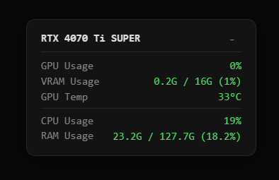

# NvEye - ComfyUI Hardware Monitor

ComfyUI already has hardware monitoring solutions such as **crystools**, but they can cause node conflicts and occupy UI space. NvEye was created as a pure hardware display widget — lightweight, non-intrusive, and conflict-free.

A lightweight hardware monitor for ComfyUI.
Displays GPU, VRAM, temperature, CPU and RAM usage directly in the ComfyUI interface.

### Installation
1. Open your terminal/command prompt.
2. Navigate to your ComfyUI `custom_nodes` folder.
3. Run: `git clone https://github.com/dogodg3838/ComfyUI-NvEye`
4. Restart ComfyUI.

## Features
- Real-time GPU / VRAM / Temperature monitoring
- CPU and RAM usage display
- 4-level color indicator (green / yellow / orange / red)
- Draggable and collapsible widget (collapse button top-right)
- Multi-language via right-click: 繁體中文 / English / 日本語 / 한국어

## Requirements
- NVIDIA GPU only
- Python package: `psutil` (auto-installed by ComfyUI Manager)

---

# NvEye - ComfyUI 硬體監控

ComfyUI 已有 **crystools** 等硬體監控解決方案，但部分節點會與其他節點產生衝突，且會佔據 UI 介面空間。因此研究並開發了 NvEye，作為純硬體顯示小視窗，輕量、不干擾介面、無節點衝突。

ComfyUI 的輕量級硬體監控工具。
在介面中顯示 GPU、VRAM、溫度、CPU 和 RAM 使用狀況。

### 安裝方法
1. 開啟終端機或命令提示字元。
2. 進入 ComfyUI 的 `custom_nodes` 資料夾。
3. 執行指令：`git clone https://github.com/dogodg3838/ComfyUI-NvEye`
4. 重啟 ComfyUI 即可。

## 功能
- 即時 GPU / VRAM / 溫度監控
- CPU 和 RAM 使用率
- 顏色指示（綠 / 黃 / 橙 / 紅）
- 可拖曳、右上角可收合的小視窗
- 右鍵多語言選項：繁體中文 / English / 日本語 / 한국어

## 需求
- 只支援 NVIDIA 顯示卡
- Python 套件：`psutil`（ComfyUI Manager 自動安裝）

---

# NvEye - ComfyUI ハードウェアモニター

ComfyUI には **crystools** などのハードウェア監視ツールがありますが、ノードの競合や UI 占有が発生する場合があります。NvEye はそれらの問題を避けるために開発された、純粋なハードウェア表示ウィジェットです。

ComfyUI 用の軽量ハードウェアモニターです。
GPU、VRAM、温度、CPU、RAM の使用状況を表示します。

### インストール
1. ターミナルまたはコマンドプロンプトを開きます。
2. ComfyUI の `custom_nodes` ディレクトリに移動します。
3. 次のコマンドを実行します：`git clone https://github.com/dogodg3838/ComfyUI-NvEye`
4. ComfyUI を再起動します。

## 機能
- リアルタイム GPU / VRAM / 温度モニタリング
- CPU および RAM 使用率
- 4段階カラーインジケーター（緑 / 黄 / オレンジ / 赤）
- ドラッグ可能・右上で折りたたみ可能なウィジェット
- 右クリックで多言語切替：繁體中文 / English / 日本語 / 한국어

## 必要環境
- NVIDIA GPU のみ対応
- Python パッケージ：`psutil`（ComfyUI Manager が自動インストール）

---

# NvEye - ComfyUI 하드웨어 모니터

ComfyUI 에는 **crystools** 같은 하드웨어 모니터링 도구가 있지만, 노드 충돌이나 UI 공간 점유 문제가 발생할 수 있습니다. NvEye 는 이러한 문제를 피하기 위해 개발된 순수 하드웨어 표시 위젯입니다.

ComfyUI 용 경량 하드웨어 모니터입니다.
GPU, VRAM, 온도, CPU, RAM 사용 현황을 표시합니다.

### 설치 방법
1. 터미널 또는 명령 프롬프트를 엽니다.
2. ComfyUI의 `custom_nodes` 디렉토리로 이동합니다.
3. 다음을 실행합니다: `git clone https://github.com/dogodg3838/ComfyUI-NvEye`
4. ComfyUI를 재시작합니다.

## 기능
- 실시간 GPU / VRAM / 온도 모니터링
- CPU 및 RAM 사용률
- 4단계 색상 표시（녹색 / 노란색 / 주황색 / 빨간색）
- 드래그 가능・우측 상단에서 접을 수 있는 위젯
- 우클릭 다국어 전환：繁體中文 / English / 日本語 / 한국어

## 요구 사항
- NVIDIA GPU 전용
- Python 패키지：`psutil`（ComfyUI Manager 자동 설치）

